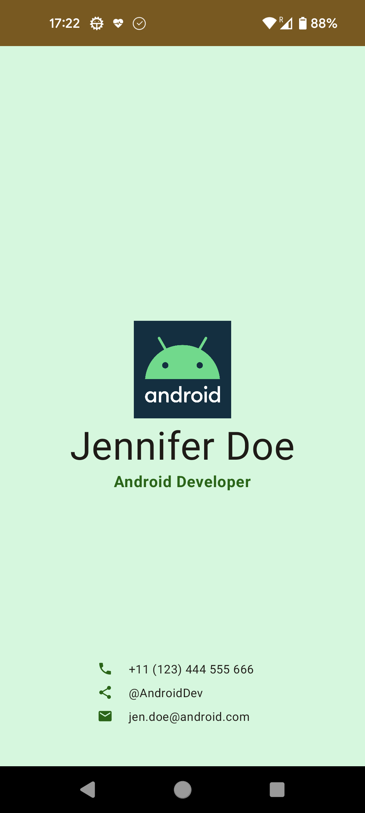

# Business Card App

I implemented a simple business card app for Android using Kotlin and Jetpack Compose.

This was created as an assignment for the online course "[Android Basics with Compose](https://developer.android.com/courses/android-basics-compose/course)" by Google.

シンプルな名刺カードアプリ(Android)をKotlinとJetpack Composeを使用して実装しました。

Googleによるオンラインコース「[Android Basics with Compose](https://developer.android.com/courses/android-basics-compose/course)」の課題として作成しました。

## What I learned - このコースを通して学んだこと

- [x] Compose Basics - Composeの基本

- Create layouts using `Row` and `Column` composers for UI elements such as `Text`, `Image`, `Icon`, etc. and align them to `Center`, etc. using `HorizontalArrangement` and `VerticalAlignment` parameters
- Customize Jetpack Compose UI elements by taking a `Modifier` parameter
- `Text`, `Image`, `Icon` などの UI 要素に対して `Row` と `Column` のコンポーザーを使用してレイアウトを構築し、`HorizontalArrangement` と `VerticalAlignment` パラメーターを用いて `Center` などに配置する
- `Modifier` パラメータを使用して、Jetpack Compose UI 要素をカスタマイズする

## Screenshot - 成果物

